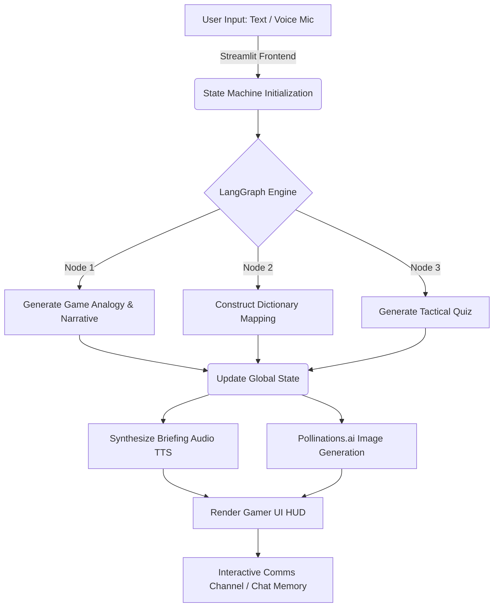

# EXPLAIN IT LIKE I PLAY
**PROJECT TRACK** 
selected from Category F: Accessibility & Advanced Utilities
Project - 29 -> The "Explain it Like I Play" Dictionary: Users select a favorite video game (like
Minecraft or Valorant) and input a complex engineering topic. The AI explains the concept
entirely through the mechanics of that specific game.

**STATUS:** `ONLINE` || **THREAT LEVEL:** `HIGH` || **FRAMEWORK:** `LANGGRAPH + GEMINI`

> "Complex engineering concepts, mapped directly into the video games you already understand."

![UI Preview] 


* Game Like Theme

* Every Node Visible , Improve User experience


* Mission briefing available in **Audio format**


* Questions to check Your Knowledge


* Downloding as PDF option also available


* Can even ask a follow UP questions as well. 

---

## 📡 [ACCESS LIVE TRANSMISSION HERE]
**Link:** ->  https://explain-like-i-play.streamlit.app/

## 🛠️ MISSION BRIEFING (Overview)
**Explain it Like I Play** is a highly interactive, agentic AI application built to translate complex computer science and engineering topics into video game mechanics. 

By leveraging a cyclical **LangGraph** state machine and the **Gemini 1.5 Flash** multimodal LLM, the system processes text or voice commands to generate a personalized "Mission Briefing." It outputs dynamic audio (TTS), a conceptual dictionary mapping table, and an interactive quiz—all wrapped in a custom-built, responsive 8-bit esports dashboard.

---

## ⚙️ SYSTEM ARCHITECTURE 
The backend engine utilizes a fault-tolerant, stateful graph execution model to ensure data structuring is strictly maintained between LLM calls.


# 🚀 DEPLOYMENT INSTRUCTIONS: EXPLAIN IT LIKE I PLAY

## ☁️ Option 1: Live Cloud Deployment (Streamlit Community Cloud)
Streamlit Community Cloud lets you deploy your apps in just one click. Follow these exact steps to host your app live on a secure HTTPS connection (which automatically enables the browser microphone permissions):

**Step 1: Push code to GitHub**
* Ensure your entire codebase (`app.py`, `graph.py`, `utils.py`, `requirements.txt`) is committed and pushed to your public GitHub repository.

**Step 2: Connect to Streamlit Cloud**
* Go to [share.streamlit.io](https://share.streamlit.io/) and click "Continue with GitHub" to log into your account.
* Once in your workspace, click the **"Create app"** button in the upper-right corner.

**Step 3: Configure the App Repository**
* **Repository:** Pick your project's GitHub repo from the dropdown menu.
* **Branch:** Select `main` (or whichever branch holds your final code).
* **Main file path:** Type in `app.py` as your entrypoint.

**Step 4: Inject API Secrets**
* Before you click Deploy, you must click on **"Advanced settings"**.
* In the "Secrets" text field, paste your API keys. *Note: Streamlit Cloud uses TOML format instead of a standard `.env` file, so format it exactly like this*:
  ```toml
  GOOGLE_API_KEY="your_gemini_key_here"
  LANGCHAIN_API_KEY="your_langsmith_key_here"
  LANGCHAIN_TRACING_V2="true"
  LANGCHAIN_PROJECT="explain-like-i-play"
  ```
* Click "Save".

**Step 5: Launch the Application**
Click "Deploy!". Your app will begin building and will launch in a few minutes. Any time you push new code to GitHub, your live app will update immediately.

## 🏆 TECHNICAL METRICS
* Multimodality: Integrated st.audio_input for direct voice-to-text processing via Gemini.

* UI/UX: Custom CSS injection overriding native Streamlit components for a unified, dark-mode 8-bit aesthetic.

* Memory Management: Sliding-window context architecture for the Tactical Comms Channel (Chatbot) to prevent token overflow.

**OPERATIVE LOG: Developed by Kavya Agrawal | B.Tech Artificial Intelligence & Machine Learning (2024-2028).**

